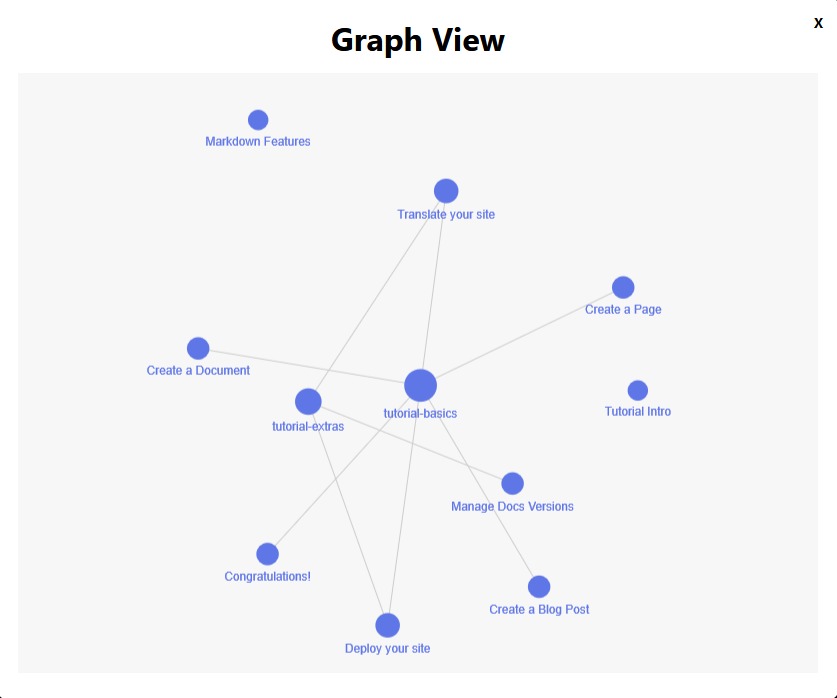
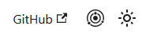
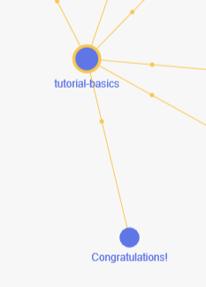
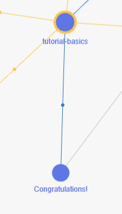

# docusaurus-graph

<!-- PROJECT LOGO -->
<br />
<p align="center">
    

  <h3 align="center">docusaurus-graph</h3>

  <p align="center">
    Graphview docusaurus
    <br />
</p>

<!-- TABLE OF CONTENTS -->

## Table of Contents

- [Overview](#overview)
  - [Built With](#built-with)
  - [Features](#features)
- [Getting Started](#getting-started)
  - [Prerequisites](#prerequisites)
  - [Installation](#installation)
- [Usage](#usage)
  - [Configuration options](#configuration-options)
- [How it works](#how-it-works)
- [Development](#development)
- [Contributing](#contributing)
- [License](#license)
- [Acknowledgements](#acknowledgements)

## Overview

The Docusaurus GraphView Plugin is an open source plugin designed to generate a graph view from your Docusaurus documentation files.
This visual representation helps in understanding the relationships between different documents, making navigation and comprehension easier.

### Built with

- [Node](https://nodejs.org/en/about/)
- [Typescript](https://www.typescriptlang.org/)
- [note-graph](https://github.com/hikerpig/note-graph)
- [Best README Template](https://github.com/othneildrew/Best-README-Template)

### Features

- Automatically generates a graph view from your documentation.
- Interactive and customizable graph visualization.
- Easy integration with your existing Docusaurus site.

## Getting Started

To get a local copy up and running follow these next steps.

### Prerequisites

This project requires Node, yarn and git installed.

### Installation

To install the plugin, you need to have Docusaurus set up. Follow these steps to add the GraphView plugin to your project:

1. Install the plugin via npm or yarn:

```sh
npm install docusaurus-graph
```

or

```sh
yarn add docusaurus-graph
```

2. Add the plugin to your Docusaurus site configuration (**docusaurus.config.js**):

```js
module.exports = {
  // Other Docusaurus configurations...
  plugins: [
    [
      'docusaurus-graph',
      {
        path: 'docs', // Specify the folder of your documentation
      },
    ],
  ],
};
```

> The default path is `docs`.

3. Build the project to create the data file.

```sh
npm run build
```

or

```sh
yarn build
```

## Usage

Once the plugin is installed and configured, it will automatically generate a graph view of your documentation. You can access the graph view from a new button at the top right of your Docusaurus site.

<p align="center">
    
</p>

### Configuration options

The plugin supports one option to get the path folder.

Example configuration:

```js
module.exports = {
  // Other Docusaurus configurations...
  plugins: [
    [
      'docusaurus-graph',
      {
        path: 'docs', // Specify the folder of your documentation
      },
    ],
  ],
};
```

- `path`: (default: `docs`) The folder containing your documentation files.

### Markdown files

To create link between files, there are 2 tags :

#### Categories

Set the categories tag to a markdown file or a name (a file that doesn't exist). Example:

To a markdown file (intro.md):

```md
## [comment]: <> (congratulations.md)

sidebar_position: 6
categories: intro

---

# Congratulations!

You have just learned the **basics of Docusaurus** and made some changes to the **initial template**.

Docusaurus has **much more to offer**!
```

To a name:

```md
## [comment]: <> (congratulations.md)

sidebar_position: 6
categories: tutorial-basics

---

# Congratulations!

You have just learned the **basics of Docusaurus** and made some changes to the **initial template**.

Docusaurus has **much more to offer**!
```

Result :

<p align="center">
    
</p>

**To set multiple categories (or references) see this example :**

```md
## [comment]: <> (congratulations.md)

sidebar_position: 6
categories:

- intro
- tutorial-basics

---
```

#### References

Set the references tag to a markdown file or a name (a file that doesn't exist). Example:

To a markdown file (intro.md):

```md
## [comment]: <> (congratulations.md)

sidebar_position: 6
references: intro

---

#### Differences

What's the difference between categories and references ?

See the categories like a parent or a chapter. Example : Car -> Engine.
The references is more like a child. Example : Wheel -> Car.

# Congratulations!

You have just learned the **basics of Docusaurus** and made some changes to the **initial template**.

Docusaurus has **much more to offer**!
```

To a name:

```md
## [comment]: <> (congratulations.md)

sidebar_position: 6
references: tutorial-basics

---

# Congratulations!

You have just learned the **basics of Docusaurus** and made some changes to the **initial template**.

Docusaurus has **much more to offer**!
```

Result :

<p align="center">
    
</p>

## How it works

The Docusaurus GraphView Plugin works by parsing your Docusaurus documentation files located in the specified `path` and creating a visual graph representation based on the relationships between them. Here’s a high-level overview of the process:

- **File Parsing**: The plugin scans the documentation files in your specified folder (path) to identify references between documents.
- **Graph Construction**: Using the parsed data, the plugin constructs a graph data structure where nodes represent documents and edges represent references between them.
- **Graph Visualization**: The constructed graph is then rendered using a graph visualization library (such as note-graph (D3.js)), applying the configured layout and styles.
- **Interactive Elements**: The generated graph is interactive, allowing users to zoom in/out and drag nodes for better viewing.

> After the Docusaurus build process completes, the Docusaurus GraphView Plugin generates a data file containing the parsed documentation structure. This file, typically named `docusaurus-graph.json`, includes all the necessary information to construct the graph view, such as nodes (documents) and edges (links between documents). The file is created in the `build` directory of your Docusaurus project.

## Development

If you want to contribute to the plugin or modify it for your own use, follow these steps:

1. Clone the repository

```sh
git clone https://github.com/Arsero/docusaurus-graph.git
```

2. Navigate to the project directory:

```sh
cd docusaurus-graph
```

3. Install the dependencies:

```sh
yarn install
```

4. Make your changes and test them locally. To test them go to the `demo` folder.

```sh
cd demo
yarn install
yarn start
```

> The plugin is link to the `demo` project. The project is a simple docusaurus website with the plugin added.

## Contributing

We welcome contributions to the Docusaurus GraphView Plugin! If you have ideas, suggestions, or bug reports, please open an issue or submit a pull request. Follow these steps to contribute:

- Fork the repository.
- Create a new branch for your feature or bugfix.
- Make your changes and commit them with clear and concise messages.
- Open a pull request to the main repository.

## License

This project is licensed under the MIT License - see the [LICENSE](./LICENSE) file for details.

## Acknowledgements

- [note-graph](https://github.com/hikerpig/note-graph) library used in this plugin.
